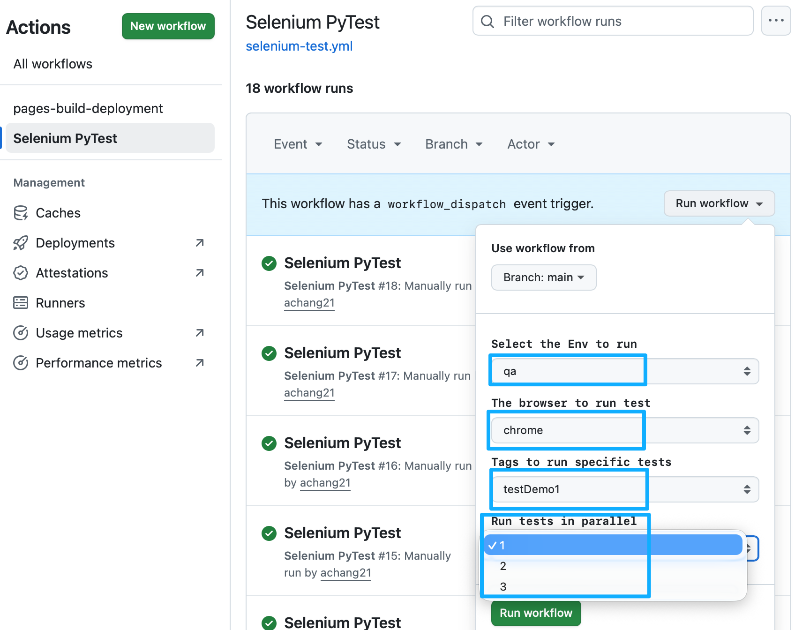
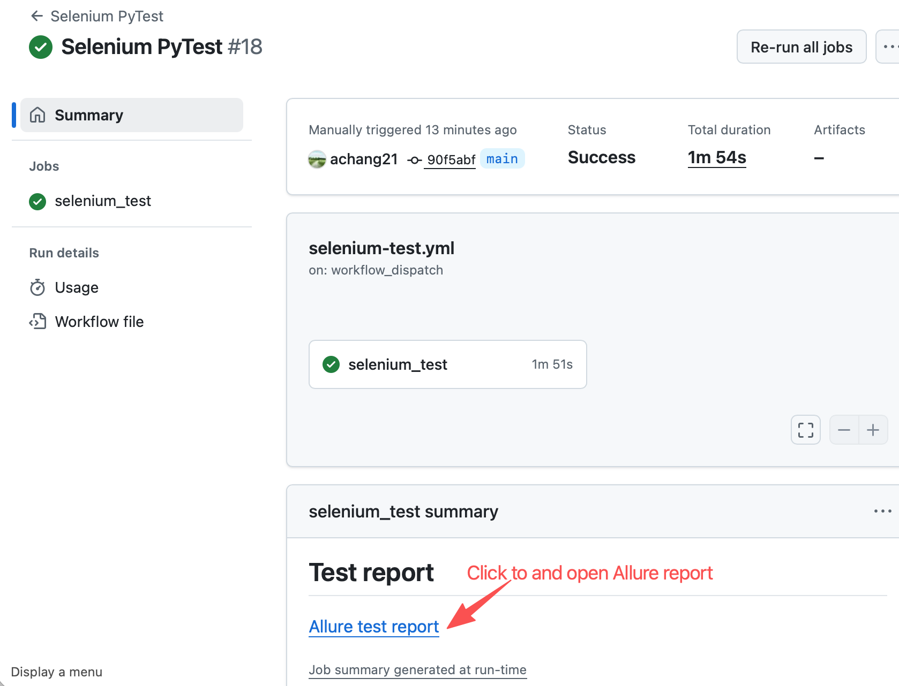
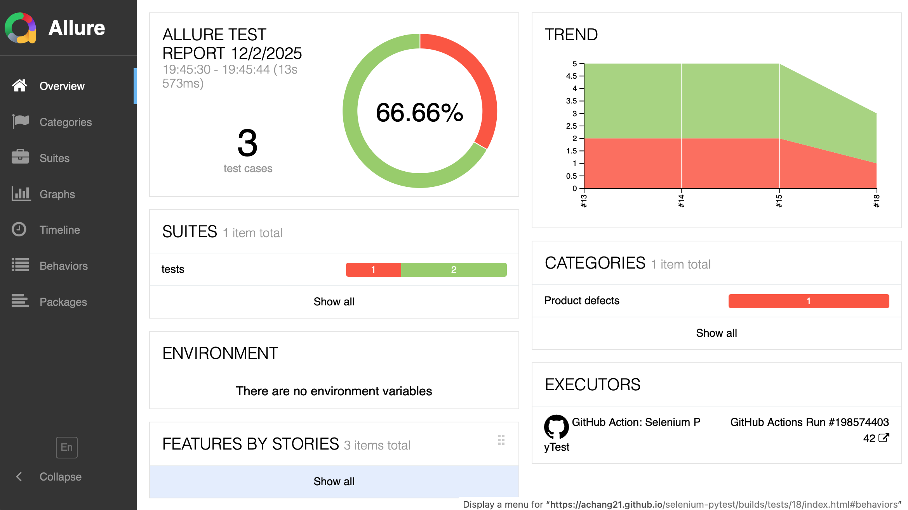

# Selenium Pytest Demo Project

This is a demo for Selenium, PyTest, Github actions, parallel testing, publish allure report with gh-pages

## Key points
- Selenium tests with PyTest(POM, fixtures designed)
- Select Env, browser, tags, parallel jobs while run workflow
- Use pytest-xdist for running test in parallel
- Take screenshot while test failed and attach it to Allure report
- Integrate Allure report
- Integrate with GitHub Actions for CI/CD
- Publish Allure report to gh-pages after testing finished
- Use Github Secrets to store password and use it in workflow
- Use logic for updating Env while run workflow
## See screenshot



## Notes
- Env: qa for "saucedemo" for demo purpose
- Support browser: chrome and firefox, but firefox not be integrated to pipeline

## Run tests at local
- Needs to replace the password in config/env/{env}.env file:
```
PASSWORD=your_password_here
```
- Install dependecies
```
pip install -r requirements.txt
```
- Run with command
```
pytest tests -n 2 --browser chrome --env qa -m testDemo1
```